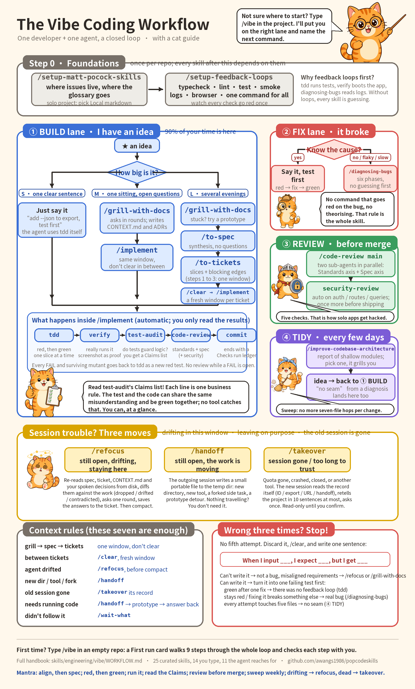
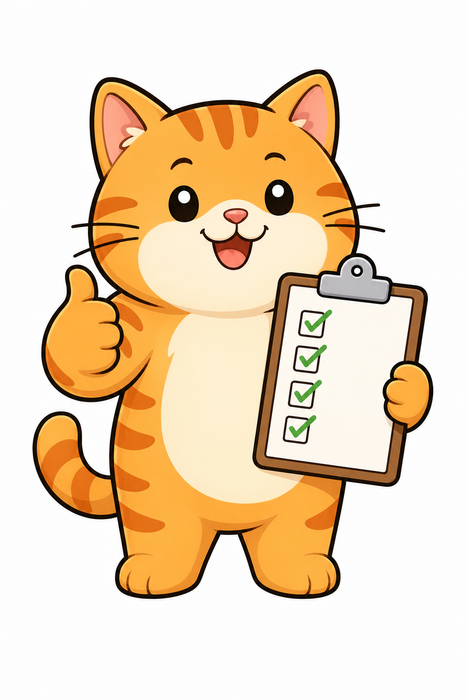

<p align="center">
  
</p>

<h1 align="center">猫咪 Skills</h1>

<p align="center">
  <strong>一个人加一个 agent 的完整 vibe coding 工作流，由猫咪来教。</strong><br>
  可用于 Claude Code、Codex、Pi，以及任何能读 <code>SKILL.md</code> 目录的 agent。
</p>

<p align="center">
  <a href="./README.md">English</a> | <strong>简体中文</strong>
</p>

<p align="center">
  <a href="#快速开始">快速开始</a> ·
  <a href="#工作流一览">工作流</a> ·
  <a href="#猫咪-skills-做什么">它做什么</a> ·
  <a href="#认识这些猫">认识这些猫</a> ·
  <a href="#参考全部-skill">全部 skill</a>
</p>

---

> **本项目是 [mattpocock/skills](https://github.com/mattpocock/skills) 的分支（fork）。** 这个仓库里的工程纪律，以及其中大部分 skill，都是 [Matt Pocock](https://www.aihero.dev) 的作品：grilling 式访谈、spec 和 ticket 流程、`tdd`、`code-review`、领域建模、深模块架构巡检，以及那套让一个 skill 小到可以信任的写作约定。没有它们就没有猫咪 Skills。谢谢你，Matt。想要原版 skill、他对每个 skill 的设计思路，以及他持续发布的更新，请去 [mattpocock/skills](https://github.com/mattpocock/skills) 和[他的 newsletter](https://www.aihero.dev/s/skills-newsletter)。

猫咪 Skills 在这套 skill 的基础上做了筛选和扩展，专门服务于**一个人的 vibe coding**：你说想要什么，agent 去做，工作流负责保证 agent 做的是对的东西，并且做完之后代码库还值得留着。

Vibe coding 有两种翻车方式：agent 根本没听懂你，做出来的不是你要的；代码库在你察觉之前就烂成了一团泥。Matt 的 skill 两个都能治，但一共二十五个，你得自己知道该敲哪一个。猫咪 Skills 补上了一个人单干时缺的那几块：

- **`/vibe`**：一条命令。它看一眼你的仓库，把你放到正确的车道上，并且说出下一步该敲的确切命令。你不需要记住整张地图。
- **一个闭环**：需求 → spec → tickets → 测试 → 跑起来的证据 → 审查 → 提交。每一步都由 agent 自己调用，你只负责看结果。
- **会话照料**：`refocus`、`handoff`、`takeover`，分别应对对话跑偏、要换地方、以及会话彻底没了这三种情况。
- **`/askcat`**：一只猫在一个 HTML 页面上，用大白话、用你的语言，把你装了的每个 skill 讲一遍。

原来的 skill 全都还在，精神未改。猫咪 Skills 是穿过它们的一条路，再加上这条路需要而原来没有的几个 skill。

## 猫咪 Skills 做什么

这套工作流覆盖一个独立开发者反复手工做的八件事，每一件配一个 skill。

| 事情 | 以前哪里出错 | 你敲什么 | agent 做什么 |
| --- | --- | --- | --- |
| **把需求说清楚** | 你讲一遍，agent 点头，然后做出别的东西 | `/grill-with-docs` | 一轮一轮地访谈你，直到设计树上没有一个分支是悬着的；把共享词汇写进 `CONTEXT.md`，把难以逆转的决定写进 ADR |
| **拆成小块** | 一个巨型 prompt，一个巨型 diff，什么都没法审 | `/to-spec` 然后 `/to-tickets` | 把对话整理成 spec，不再提新问题；然后切成带阻塞关系的 tracer-bullet tickets |
| **写下来，做出来** | spec 活在聊天里，随聊天一起蒸发 | `/implement` | 认领一张 ticket，用 `tdd` 先红后绿，一次一小片；提交前跑完下面的所有检查 |
| **决定测什么** | 代码有了，测试没有，能想到的每个测试都显得很随意 | `/cattytest` | 访谈你：什么绝不能坏、在哪个接缝上看、拿什么判断对错；写出一份由业务规则断言组成的测试计划和前五个红测试，然后交给 `tdd` |
| **证明它能跑** | "测试全过"，但应用起不来 | 自动：`verify` | 把做出来的东西真的跑起来，像用户一样逐条走验收标准，每个结论配一张截图或一段捕获的输出 |
| **找 bug、修 bug** | agent 靠猜，糊住症状，弄坏别的地方 | 直接说，或 `/diagnosing-bugs` | 你懂原因的 bug，先变成一个失败的测试。你不懂的 bug，走六个有闸门的阶段：让它变红 → 最小化 → 假设 → 插桩 → 修复 → 回归测试 |
| **检查代码质量** | 永远不会失败的测试、没有鉴权的路由、打进包里的密钥 | 自动：`test-audit`、`code-review`、`security-review` | 把每个测试翻译成一条你看得懂的业务断言，再对代码做变异看测试能否察觉；从两个轴（规范、spec）并行审 diff；检查独立开发者最常上线的五种安全漏洞 |
| **检查架构** | 每次改动都要碰七个文件，而你已经习惯了 | `/improve-codebase-architecture` | 巡检代码库里的浅模块，给你一份 HTML 报告，就你选中的那一个访谈你，它就是你下一个要做的东西 |

后来发现还有两件事和这八件同样重要：

| 事情 | 你敲什么 | agent 做什么 |
| --- | --- | --- |
| **长会话里让 agent 别跑偏** | `/refocus` | 从磁盘重读 spec、ticket 和你口头做过的每个决定，跟实际做出来的东西比对，报告哪些被丢了、哪些跑偏了，问一轮问题，把答案写回去 |
| **会话结束也不丢工作** | `/handoff`（主动离开）或 `/takeover`（旧会话已经没了） | 离开的会话写一个小的可携带文件；接手的会话从导出、ID、URL 或 handoff 文件重建上下文，在动任何东西之前先跟你确认理解是否准确 |

## 工作流一览

四条车道、一步初始化，再加三招应对会话出状况。你任何时候都恰好在一条车道上。`/vibe` 替你读这张地图；完整文字版在 [`skills/engineering/vibe/WORKFLOW.md`](./skills/engineering/vibe/WORKFLOW.md)。

<p align="center">
  <a href="./docs/engineering/vibe-workflow-poster.png">
    
  </a>
</p>

<p align="center"><sub>点击查看大图。海报由 <a href="./docs/engineering/poster/build_poster.py"><code>docs/engineering/poster/build_poster.py</code></a> 根据手册生成，所以内容是精确的。</sub></p>

**第 0 步，每个仓库一次。** `/setup-matt-pocock-skills` 决定 issue 放哪（个人项目用本地 Markdown，想要 issue 和 PR 就用 GitHub）以及词汇表放哪。`/setup-feedback-loops` 把 typecheck、lint、测试、冒烟测试、日志和浏览器接成一条命令，并逐个证明它们能变红。后面的每个 skill 都在消耗这些反馈回路；没有它们，agent 就是在猜。

**车道 1，Build：我有个想法。** 你 90% 的时间在这里。先估大小：

- **S**，一句话说得清：直接说，加一句"先写测试"。agent 自己会用 `tdd`。
- **M**，一次坐下能做完但有悬而未决的问题：`/grill-with-docs` → `/implement`，同一个窗口。
- **L**，要好几个晚上：`/grill-with-docs` → `/to-spec` → `/to-tickets` → 每张 ticket 开一个新窗口 `/implement`。有些问题必须跑代码才能回答，那就绕道 `prototype`，把答案带回访谈里。

**车道 2，Fix：坏了。** 知道原因？直接说，先写测试。不知道，或者时好时坏、或者慢？`/diagnosing-bugs`。没有一条能在这个 bug 上变红的命令之前不许推理：这条规则就是整个 skill。

**车道 3，Review：合并或上线之前。** `/code-review main` 并行跑两个子 agent，一个看规范，一个看 spec；只要 diff 碰到鉴权、路由、查询、环境变量或依赖，`security-review` 会自动加入。任何东西上互联网之前再跑一次。

**车道 4，Tidy：每隔几天。** `/improve-codebase-architecture` 找出浅模块，就其中一个访谈你。产出是一个想法，想法回到车道 1。

**`/implement` 内部，自动进行：** `tdd` → `verify` → `test-audit` → `code-review` → 提交。每一个 FAIL 和每一个没被测试杀死的变异体，都会作为一个新的红测试回到 `tdd`。你只需要看结果，而最值得细看的一份结果是 `test-audit` 的 Claims 列表：每一行是一条业务规则，测试和代码可能共享同一个误解并且一起变绿。没有工具能抓住这个，你扫一眼就能。

**错了三次？停。** 不做第五次尝试。丢掉它，写一句话：*当我输入 ___，我期望 ___，但得到 ___*。写不出来？那不是 bug，是需求没对齐：`/refocus` 或 `/grill-with-docs`。写得出来？先把它变成一个失败的测试。

**第一次来？** 在一个空仓库里敲 `/vibe`。它会给你一张 First run 卡片，用九步把整个闭环走一遍，每一步都跟你一起检查。

## 快速开始

### 1. 拿到 skill

<details>
<summary><strong>任何 agent，从 clone 安装（Claude Code、Codex、Pi）</strong></summary>

```bash
git clone https://github.com/awangs1986/popcodeskills.git
cd popcodeskills
scripts/link-skills.sh
```

这会把每个 skill 软链到 `~/.claude/skills`、`~/.agents/skills` 和 `~/.pi/agent/skills`，之后一次 `git pull` 三处同时更新。每个 skill 都是宿主中立的：没有 Claude 专属的工具名，每个 skill 同时带着 Claude Code 的 frontmatter 和 Codex 的 `agents/openai.yaml`。文中的 `/clear` 和 `/compact` 指的是你的 agent 里"开新窗口"和"压缩当前窗口"对应的那个操作。

</details>

<details>
<summary><strong>Codex 及其他 agent，用 skills.sh 安装器</strong></summary>

```bash
npx skills@latest add awangs1986/popcodeskills
```

选你要的 skill，以及装到哪些 agent 上。**确保 `setup-matt-pocock-skills` 和 `vibe` 在其中。** 文件会以普通文件的形式落到你的项目里，归你所有；想更新时执行 `npx skills update`。

</details>

<details>
<summary><strong>Claude Code，作为插件安装</strong></summary>

这个分支不在官方 marketplace 里。先把它添加为一个 marketplace，再安装：

```
/plugin marketplace add awangs1986/popcodeskills
/plugin install mattpocock-skills@mattpocock
```

如果你更想订阅 Matt 的上游原版，`claude plugins install mattpocock-skills` 装的是不含猫咪 Skills 新增内容的原版 skill。

</details>

### 2. 初始化仓库，只做一次

```
/setup-matt-pocock-skills
/setup-feedback-loops
```

第一个问三个问题（issue tracker、triage 标签、文档放哪），然后往你的 `CLAUDE.md` 或 `AGENTS.md` 里写一段 `## Agent skills`。第二个接好并验证你的反馈回路。两个加起来几分钟，以后不用再做。

### 3. 敲 `/vibe`

```
/vibe                       → 你上次做到哪、现在在哪条车道
/vibe add CSV export        → 一张路线卡：车道、下一条命令、再然后
/askcat                     → 一只猫把你装了的每个 skill 讲一遍
```

这就是全部的界面。其他一切都是 `/vibe` 在该敲的时候告诉你敲的。

## 认识这些猫

海报上的每只猫代表闭环的一个部分。`/askcat` 把它们放到一个网页上，让它们自己来讲 skill。

<table>
  <tr>
    <td align="center" width="16%"><br><strong>老师</strong><br><sub><code>/vibe</code>、<code>/askcat</code></sub></td>
    <td align="center" width="16%"><br><strong>检查员</strong><br><sub><code>verify</code>、<code>test-audit</code></sub></td>
    <td align="center" width="16%"><br><strong>侦探</strong><br><sub><code>diagnosing-bugs</code></sub></td>
    <td align="center" width="16%"><br><strong>卫士</strong><br><sub><code>code-review</code>、<code>security-review</code></sub></td>
    <td align="center" width="16%"><br><strong>清扫工</strong><br><sub><code>improve-codebase-architecture</code></sub></td>
    <td align="center" width="16%"><br><strong>找不着北的那只</strong><br><sub><code>refocus</code>、<code>handoff</code>、<code>takeover</code></sub></td>
  </tr>
</table>

- **老师**认得地图。不想琢磨下一个该用哪个 skill 时敲 `/vibe`；想让整套 skill 用大白话在一页上讲清楚时敲 `/askcat`。
- **检查员**不相信绿色。`verify` 把应用跑起来，逐条走验收标准，每个结论一张截图；`test-audit` 把每个测试改写成一条业务断言，再对代码做变异，看测试到底有没有察觉。
- **侦探**从不猜。`diagnosing-bugs` 在拿到一条能在这个 bug 上变红的命令之前拒绝推理，然后按顺序走完六个阶段。
- **卫士**把 diff 读两遍，一遍看规范，一遍看 spec；只要改动碰到了互联网够得着的东西，就带上安全检查清单。
- **清扫工**每隔几天来一趟。`improve-codebase-architecture` 找出那些"改一处要跳七个文件"的模块，就其中一个访谈你把它修好。
- **找不着北的那只**就是三小时会话之后的你。`refocus` 从磁盘重读一切，告诉你什么跑偏了；`handoff` 把工作打包带走；`takeover` 在新会话里从任何幸存的记录重建它。

## 这个分支新增了什么

上游有二十五个 skill，这个仓库有三十四个。下面每一个相对上游都是新的，各自有完整的 `SKILL.md`、文档页和 changeset。

| Skill | 为什么原来缺它 |
| --- | --- |
| [`vibe`](./skills/engineering/vibe/SKILL.md) | 上游有 `ask-matt`，是覆盖全部二十五个上游 skill 的路由器。一个人单干需要一张更小的地图，每个岔路口都有默认选项，再加一张 First run 卡片和一段隔了两周回来时的"你上次做到哪" |
| [`setup-feedback-loops`](./skills/engineering/setup-feedback-loops/SKILL.md) | `tdd` 要跑测试，`verify` 要起应用，`diagnosing-bugs` 要读日志。原来没有东西把这些接好，也没有东西证明它们能失败 |
| [`verify`](./skills/engineering/verify/SKILL.md) | 测试全绿不等于应用能用。得有人把它跑起来，带着证据逐条走验收标准 |
| [`test-audit`](./skills/engineering/test-audit/SKILL.md) | agent 写的测试天生就是过的。把它们翻译成业务断言、再用变异体去试探，是一个不懂测试的人唯一能做的检查 |
| [`security-review`](./skills/engineering/security-review/SKILL.md) | 独立开发者做的应用总是带着同样的五个洞上线。它是 `code-review` 的第三个条件触发的子 agent |
| [`refocus`](./skills/engineering/refocus/SKILL.md) | 长会话会跑偏，而 `/compact` 扔掉的恰恰是最要紧的那些决定。压缩之前先回到原始来源上重新对齐 |
| [`takeover`](./skills/productivity/takeover/SKILL.md) | `handoff` 要求旧会话还活着并且配合。`takeover` 是这座桥的另一端：从导出、ID、URL 或 handoff 文件重建，确认之后再继续 |
| [`askcat`](./skills/productivity/askcat/SKILL.md) | 把 `teach` 对准这套 skill 本身：一个 HTML 页面、每个装了的 skill、大白话、猫 |
| [`cattytest`](./skills/engineering/cattytest/SKILL.md) | `tdd` 会问"测哪些接缝？"，做了一半的项目答不上来。这是一场能产出答案的访谈：断言、接缝、判据、真假依赖，以及按顺序排好的前几个红测试 |

整个仓库范围内还改了这些：

- **`implement` 是一条闭环链。** 认领 ticket → `tdd` → `verify` → `test-audit` → `code-review`（+ `security-review`）→ 提交 → 关闭 ticket → 一份 Checks run 台账。每个 FAIL 和每个存活的变异体都回到 `tdd`。
- **每个 skill 都是宿主中立的。** 任何地方都没有 Claude 专属的工具名。skill 里写的是 *Invoke the "X" skill*，在 Claude Code 里是 Skill 工具，在 Codex 里是 skill 引用，在 Pi 或其他任何 agent 里就是"去读那个 SKILL.md"（见 [`.agents/invocation.md`](./.agents/invocation.md)）。
- **skill 用英文写，agent 用你的语言回答。** 没有任何 skill 写死输出语言。`setup-matt-pocock-skills` 会往你的 `CLAUDE.md` / `AGENTS.md` 里写一条语言规则：用用户写的语言回复，名字、命令和路径保持原样。
- **手册和海报。** [`WORKFLOW.md`](./skills/engineering/vibe/WORKFLOW.md) 是长版：整套 skill、四条车道、上下文规则、这套工作流里的 git、项目变大了怎么办，以及两个完整走完的会话。上面的海报是同一份东西的一页版。

## 致谢与许可

上游是 [Matt Pocock](https://www.aihero.dev) 的 [mattpocock/skills](https://github.com/mattpocock/skills)，从 v1.2.3 分出。这里三十四个 skill 中的二十五个是他的，精神保持原样，只在单人工作流或宿主中立需要的地方做了调整；仓库的约定（`CLAUDE.md`、文档页、changeset 流程）也是他的。猫、`/vibe` 工作流、手册、海报，以及*这个分支新增了什么*里列的九个 skill，是为这个仓库做的。

MIT 许可，与上游相同。原始版权声明保留在 [`LICENSE`](./LICENSE) 中。

## 参考：全部 skill

按一个维度划分：谁能调用。**用户调用**的 skill 只有你敲它时才会被触发（例如 `/grill-me`），它们负责编排。**模型调用**的 skill 你可以敲，agent 在任务合适时也会自己去用，它们承载可复用的纪律。用户调用的 skill 可以调用模型调用的 skill，但绝不调用另一个用户调用的 skill。

skill 本身是英文写的；下面的说明是中文，名字和命令与英文版一致。

### 工程（Engineering）

日常写代码用的 skill。

**用户调用**

- **[ask-matt](./skills/engineering/ask-matt/SKILL.md)**：问哪个 skill 或哪条流程适合你现在的处境。覆盖本仓库全部用户调用 skill 的路由器。
- **[vibe](./skills/engineering/vibe/SKILL.md)**：独立开发者的调度员：把你放到四条车道之一（build、fix、review、tidy），估算工作大小，说出下一条要敲的确切命令。是整张地图为一个人单干而精选的子集。
- **[refocus](./skills/engineering/refocus/SKILL.md)**：让长会话重新锚定在需求上：从原始来源重读 spec、ticket 和每一个决定，检查实际做出来的东西是否符合，报告偏差，就来源里模糊的地方问一轮问题，然后再继续。
- **[grill-with-docs](./skills/engineering/grill-with-docs/SKILL.md)**：一场同时构建项目领域模型的访谈，边问边打磨术语，就地更新 `CONTEXT.md` 和 ADR。
- **[triage](./skills/engineering/triage/SKILL.md)**：让 issue 按一组分诊角色组成的状态机流转。
- **[improve-codebase-architecture](./skills/engineering/improve-codebase-architecture/SKILL.md)**：扫描代码库寻找可以加深的模块，以可视化 HTML 报告呈现，然后就你选中的那一个访谈你。
- **[setup-matt-pocock-skills](./skills/engineering/setup-matt-pocock-skills/SKILL.md)**：为工程类 skill 配置这个仓库（issue tracker、triage 标签、领域文档布局）。使用其他工程 skill 之前每个仓库运行一次。
- **[setup-feedback-loops](./skills/engineering/setup-feedback-loops/SKILL.md)**：审计并接通其他 skill 要消耗的反馈回路（typecheck、lint、测试、格式化、冒烟测试、开发日志、浏览器、pre-commit 护栏），证明每一个都能变红，把命令记录到 `docs/agents/feedback-loops.md`。每个仓库一次，技术栈变化时再来一次。
- **[to-spec](./skills/engineering/to-spec/SKILL.md)**：把当前对话变成一份 spec 并发布到 issue tracker。不做访谈，只整理你已经讨论过的内容。
- **[to-tickets](./skills/engineering/to-tickets/SKILL.md)**：把任何计划、spec 或对话拆成一组 tracer-bullet tickets，每张声明自己的阻塞关系；写成本地文件里的文字，或真实 tracker 上的原生阻塞链接。
- **[implement](./skills/engineering/implement/SKILL.md)**：按 spec 或一组 ticket 做出功能：在事先约定的接缝上驱动 `/tdd`，变绿后跑 `/verify` 和 `/test-audit`，最后用 `/code-review` 和一份 Checks run 台账收尾，然后提交。
- **[cattytest](./skills/engineering/cattytest/SKILL.md)**：就"这个做了一半的功能或项目该怎么测"访谈你：哪些行为绝不能坏、在哪个接缝上观察、拿什么判断对错、哪些用真的哪些用假的。产出一份测试计划：编号的业务规则断言，以及按顺序排好的前几个红测试，直接交给 `tdd`。
- **[wayfinder](./skills/engineering/wayfinder/SKILL.md)**：规划一大块超出单个 agent 会话容量的工作：在 issue tracker 上建一张由决策 ticket 组成的共享地图，逐个解决，直到通往目的地的路清晰为止。

**模型调用**

- **[prototype](./skills/engineering/prototype/SKILL.md)**：做一个用完即弃的原型来回答一个设计问题：状态/逻辑问题用一个可分享的 HTML 单文件；UI 问题用同一路由下可切换的几个风格迥异的变体。
- **[diagnosing-bugs](./skills/engineering/diagnosing-bugs/SKILL.md)**：针对难缠 bug 和性能回退的有纪律的诊断循环：先建一条在这个 bug 上会变红的反馈回路 → 最小化 → 假设 → 插桩 → 修复 → 回归测试。
- **[research](./skills/engineering/research/SKILL.md)**：对照高可信度的一手来源调查一个问题，把结论写成带引用的 Markdown 文件放进仓库，以后台 agent 运行。
- **[tdd](./skills/engineering/tdd/SKILL.md)**：红-绿-重构循环的测试驱动开发。一次一个垂直切片地做功能或修 bug。
- **[domain-modeling](./skills/engineering/domain-modeling/SKILL.md)**：主动构建并打磨项目的领域模型：拿术语对照词汇表挑战，用边界场景做压力测试，就地更新 `CONTEXT.md` 和 ADR。
- **[codebase-design](./skills/engineering/codebase-design/SKILL.md)**：设计深模块的共享纪律和词汇：小接口后面藏很多行为，放在干净的接缝上，通过这个接口可测。
- **[verify](./skills/engineering/verify/SKILL.md)**：把做出来的东西跑起来，像用户一样走一遍验收标准和用户故事，每条各走一个错误路径，每个结论配截图或捕获的输出。只观察，不修改；`implement` 在测试套件变绿后调用它。
- **[security-review](./skills/engineering/security-review/SKILL.md)**：检查 diff 里独立开发者真的会上线的五种安全失误：打进包里的密钥、没有按记录鉴权的路由、未校验的输入、绕过 RLS 的数据访问、未审计的依赖。`code-review` 的第三个条件触发的子 agent。
- **[test-audit](./skills/engineering/test-audit/SKILL.md)**：一个改动背后的测试，到底是在保护业务逻辑，还是只是能过？把每个测试翻译成领域专家看得懂的大白话断言，映射到验收标准，再做一次有针对性的变异探测。`implement` 在 `verify` 之后调用它。
- **[code-review](./skills/engineering/code-review/SKILL.md)**：对某个固定点以来的 diff 做两轴审查：**规范**（是否符合仓库的编码规范，外加 Fowler 坏味道基线？）和 **spec**（是否忠实实现了源头的 issue/spec？），以并行子 agent 运行，互不污染。
- **[resolving-merge-conflicts](./skills/engineering/resolving-merge-conflicts/SKILL.md)**：逐块处理进行中的 git merge 或 rebase 冲突，按追溯到双方一手来源的意图来解决，然后完成操作（绝不 `--abort`）。
- **[wizard](./skills/engineering/wizard/SKILL.md)**：生成一个交互式 bash 向导，带人走完只有人能做的步骤：开通基础设施、配置凭据或 CI 密钥、在陌生的第三方控制台里操作、执行一次性迁移或切换。

### 效率（Productivity）

通用的工作流工具，不限于代码。

**用户调用**

- **[askcat](./skills/productivity/askcat/SKILL.md)**：生成一个 HTML 页面，由一只卡通猫用大白话讲解每个已安装的 skill：它做什么、什么时候敲、一次好的运行长什么样，外加一个"我该用哪个？"选择器和一份首次运行清单。用你的语言。
- **[grill-me](./skills/productivity/grill-me/SKILL.md)**：就一个计划或设计接受不留情面的访谈，直到设计树上每个分支都有了答案。
- **[handoff](./skills/productivity/handoff/SKILL.md)**：把当前对话压缩成一份交接文档，让另一个 agent 能接着做。
- **[takeover](./skills/productivity/takeover/SKILL.md)**：在新会话里从 ID、导出、URL 或 handoff 文件恢复一个过长或卡住的对话：新会话为记录建索引，重建精简的上下文，用最多十句话描述项目，确认之后再继续。不需要旧会话做任何事。
- **[teach](./skills/productivity/teach/SKILL.md)**：跨多个会话教用户一项新技能或概念，把当前目录当作有状态的教学工作区。
- **[to-questionnaire](./skills/productivity/to-questionnaire/SKILL.md)**：把一个你自己答不了的决定变成一份 Markdown 问卷，交给那个能答的人，异步填写或开会一起填。它访谈你的是"怎么发"（给谁、要拿回什么），而不是问题本身。
- **[wait-what](./skills/productivity/wait-what/SKILL.md)**：某条消息没看懂的那一刻就敲它。agent 会补上你缺的上下文，用大白话、用你的语言、用你 `CONTEXT.md` 里的词汇重新讲一遍。

**模型调用**

- **[grilling](./skills/productivity/grilling/SKILL.md)**：就一个计划、决定或想法不留情面地访谈用户，直到设计树上每个分支都有了答案。是 `grill-me`、`grill-with-docs`、`triage`、`wayfinder` 和 `improve-codebase-architecture` 背后可复用的访谈原语。
- **[writing-for-agents](./skills/productivity/writing-for-agents/SKILL.md)**：为 agent 写文档：skill、AGENTS.md/CLAUDE.md，以及任何 agent 通过指针到达的文档。
